
<h1 align="center">校园疫情防控管理系统</h1>

## 简介
校园疫情防控管理系统：系统角色包括管理员和用户，功能涵盖疫情信息发布、互动交流、物资管理、用户管理和出行申请管理等，为校园疫情防控提供全面支持。    --计算机毕业设计源码；毕设源码；java毕业设计源码

## 联系方式

<h3 align="center">获取完整代码与数据库文件 + 微信：deepguan QQ: 86050149 QQ群: 783742310</h3>

<h3 align="center">可帮忙远程部署 包运行成功！提供远程部署、修改代码、设计文档指导、代码讲解等服务！</h3>

## 功能介绍（完整见运行截图）
管理员： 基本功能包括用户登录、退出以及个人信息管理。可以进行用户管理、信息管理、物资管理和隔离信息管理等。网站首页提供主导航栏及公告信息，同时支持查看和发布校园公告、疫情新闻。交流论坛模块允许查看帖子和交流互动。物资管理模块支持查看和操作物资信息，新增或删除物资操作。交通出行信息管理模块提供交通工具申请审核功能，以及出行记录的详细、修改与删除操作。除此之外，隔离信息管理提供地区及风险类型信息的筛选、新增和删除功能。

用户： 用户可进行登录、退出，以及个人信息查看及修改。在主首页，可以查看公告、疫情新闻、物资与论坛帖子等信息。交流论坛支持用户查看帖子的同时，用户可以进行评论互动。物资管理允许用户查看物资储备情况和状态，并进行相关物资领取操作。用户可以提交个人请假及交通申请表，填写理由、交通工具和行程信息。系统支持个人中心的功能查看与管理，便于在疫情防控期间进行信息记录。

## 运行截图
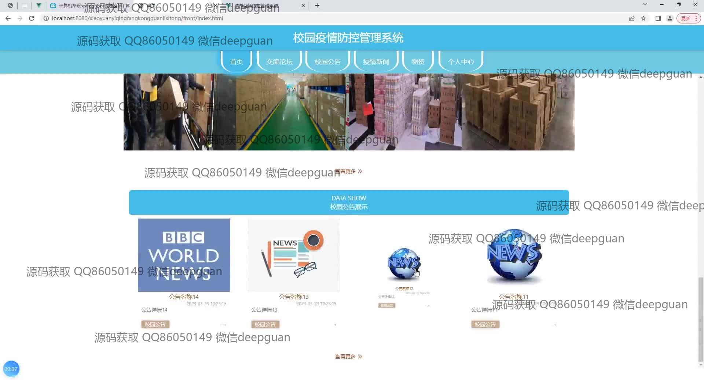
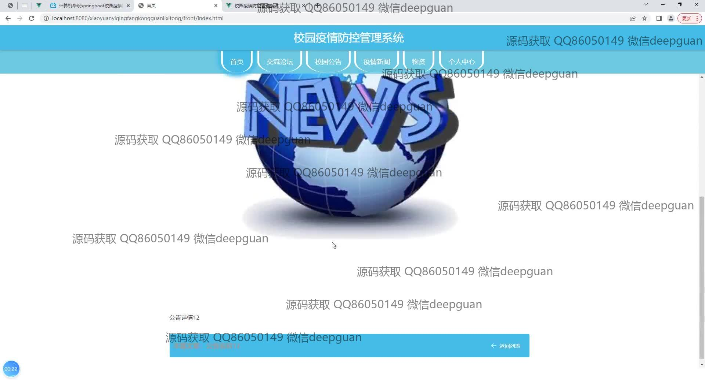
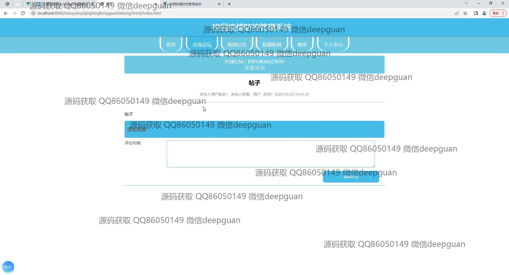
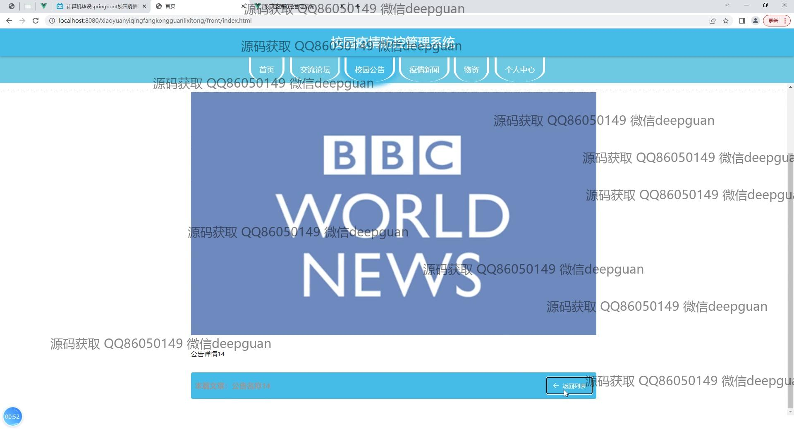
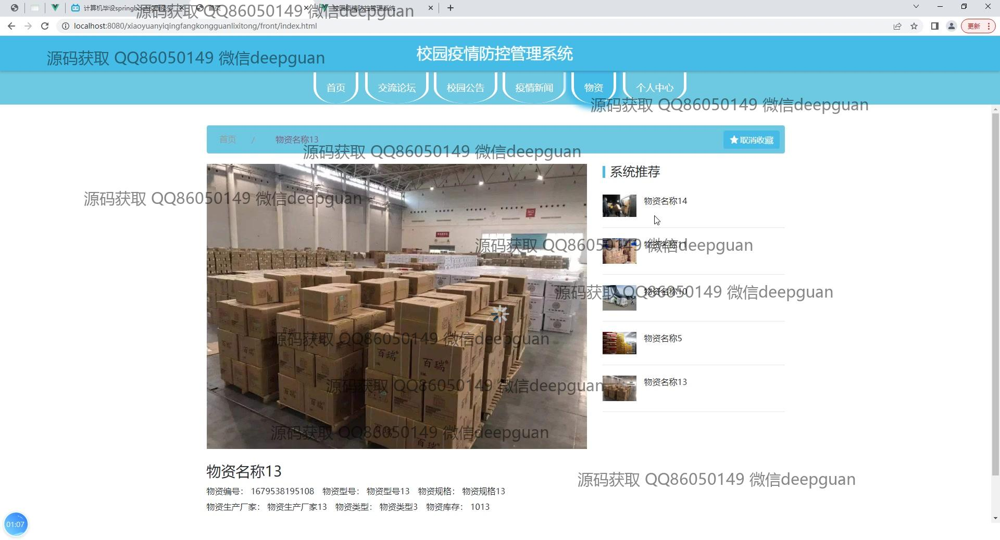
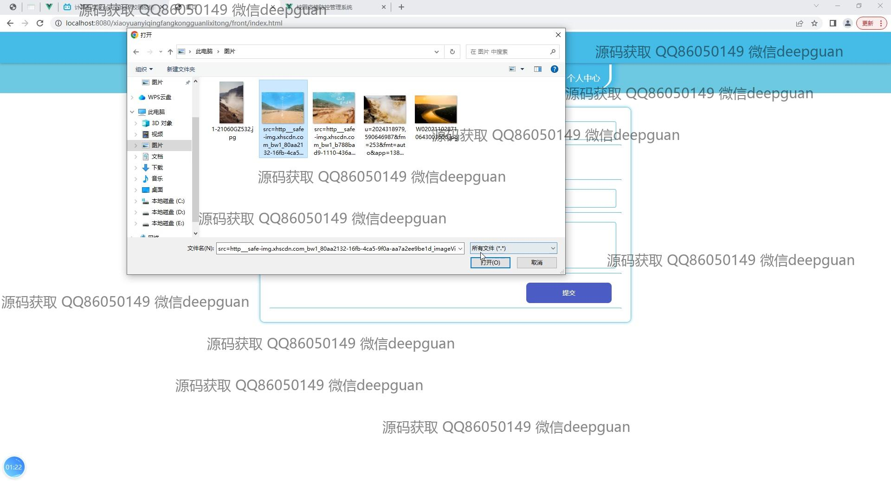
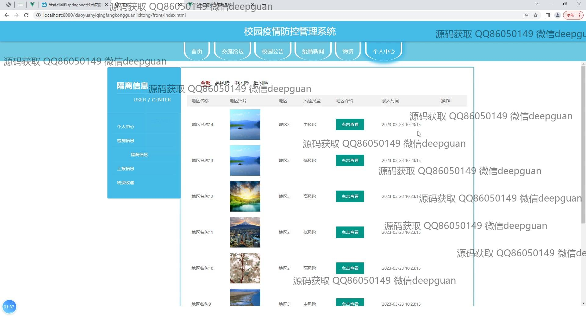
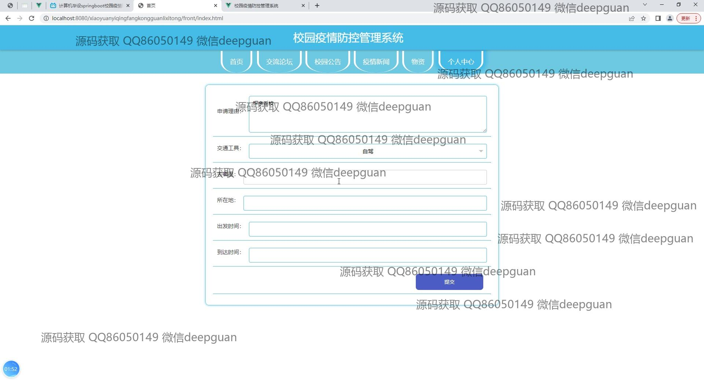
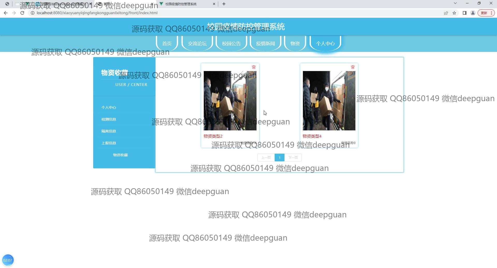
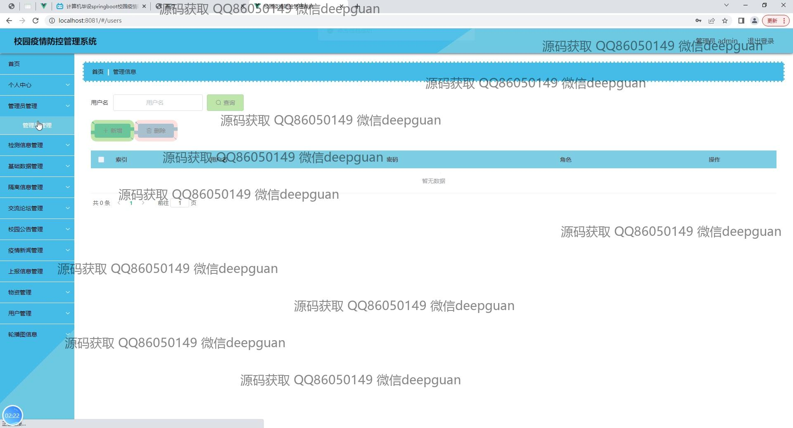
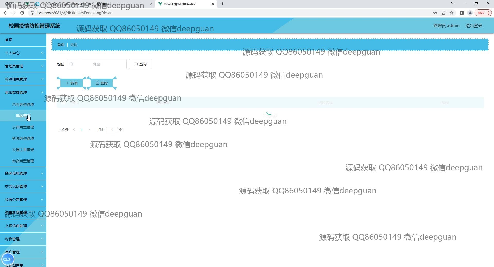
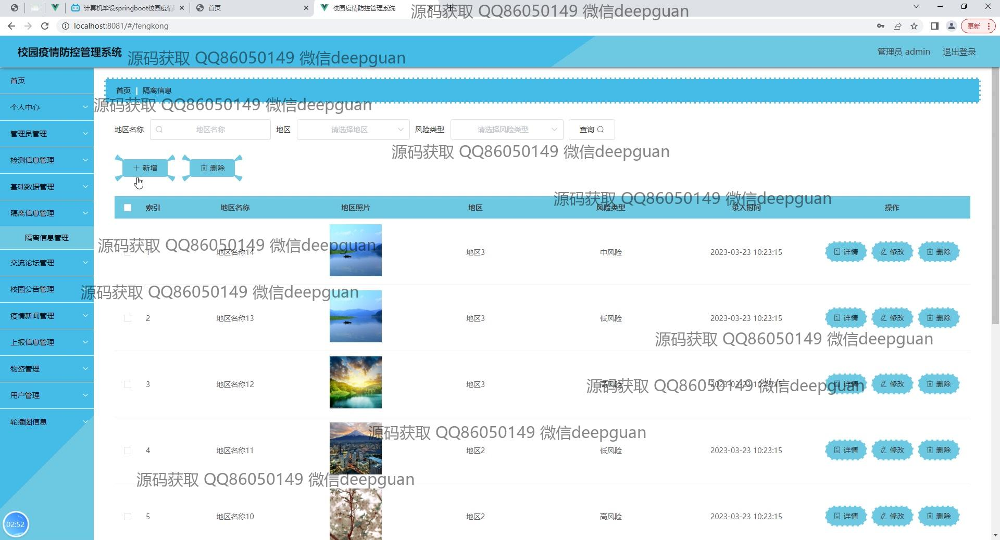
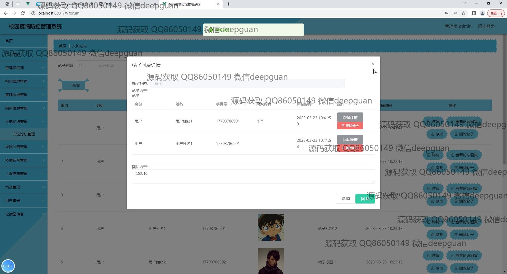
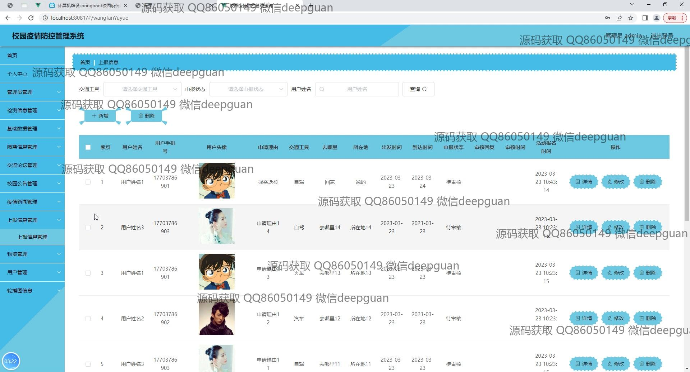
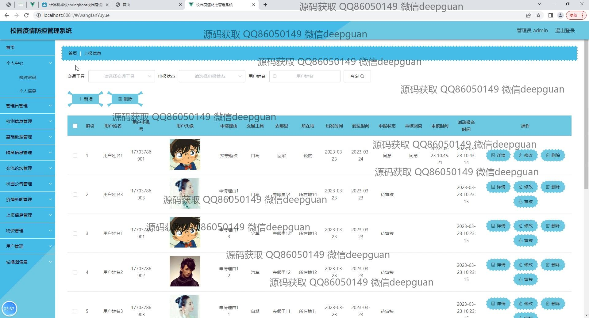
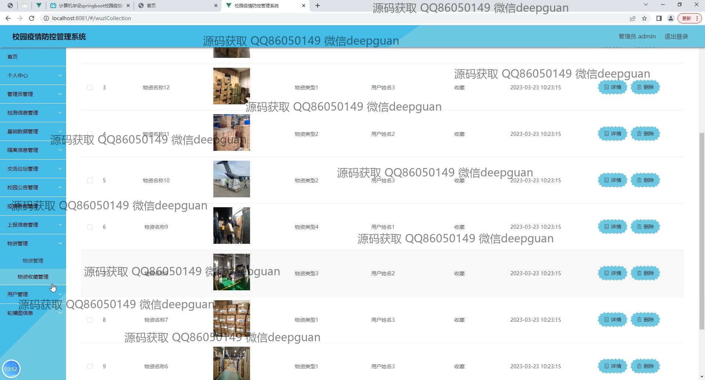
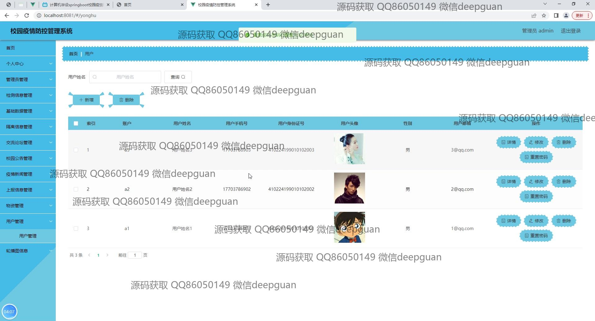

本代码来源于网络,仅供学习参考使用!

